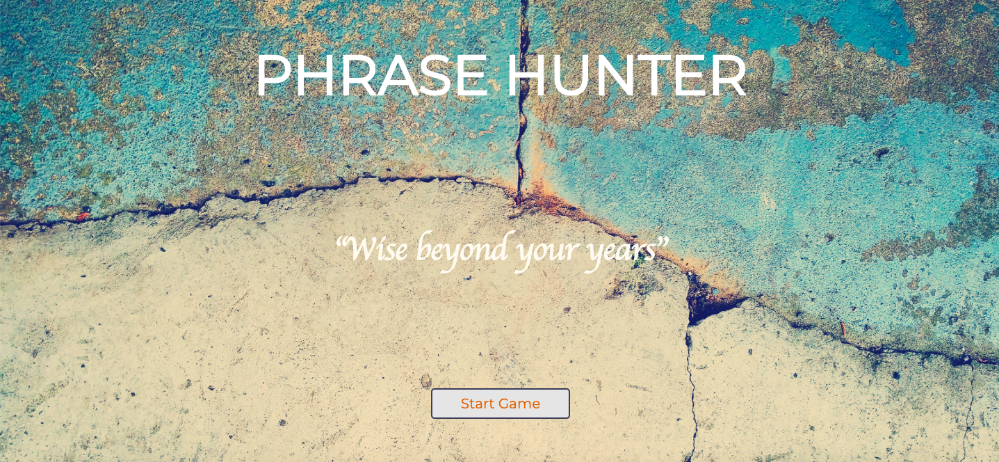
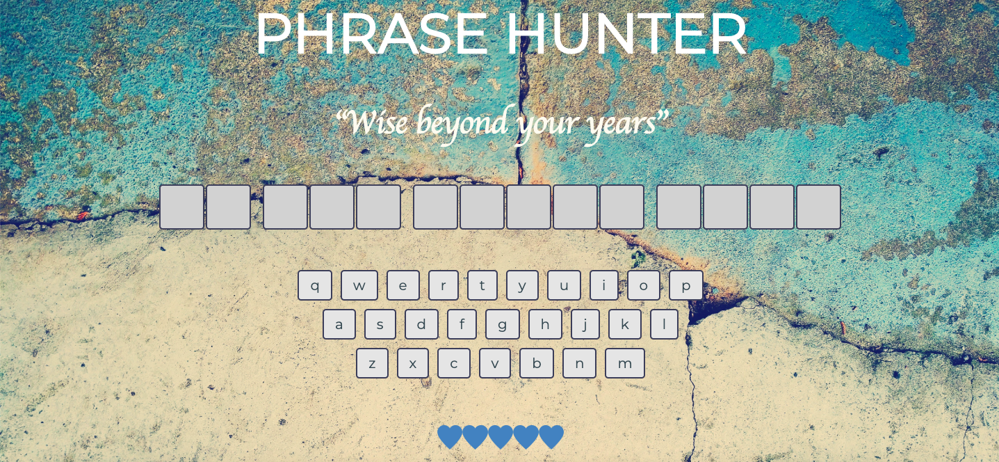

## Treehouse TAP ~ OOP PHP Game Show App

### About Project: Phrase Hunter
This project uses Object-Oriented Programming principles in PHP to create a word/phrase guessing game. The selection of phrases are random and remain hidden unitl the user selects individual letters via the onsreen keyboard or their device keyboard, to reveal the prhase, a letter at a time.

For each guess, the web app compares the player selection with the random phrase and if the letter is in the phrase, the chosen letters will be displayd on the screen. A letter can only be guessed once, at which time it will be disabled on the onscreen keyboard. The letter selection continues until the player guesses the correct phrase. If the phrase is guessed before running out of guessing attempts, a  winning screen will apear, otherwise, an alternative screen will appear if there are 5 incorrect guesses. 

### Project Sources
Base files were provided and included HTML, CSS, game board hearts, sample quotes, some of which, remained in the game, sample html and a study guide. Additional quotes were added. The look, feel and theme of the application has been modified to suit the developer's personal style.

Background image obtained from **Pixabay**. No attribution is required but is mentioned out of courtesy.
 Image by [Pexels](https://pixabay.com/users/Pexels-2286921/?utm_source=link-attribution&amp;utm_medium=referral&amp;utm_campaign=image&amp;utm_content=1850417) 
 from [Pixabay](https://pixabay.com/?utm_source=link-attribution&amp;utm_medium=referral&amp;utm_campaign=image&amp;utm_content=1850417).

Background image CSS rules obtained from **W3Schools** and can be found [here](https://www.w3schools.com/howto/howto_css_full_page.asp).

### To Play
Download the project files or clone the repository. With MAMP or similar tool running, navigate to the `index.php` page from your browser of choice and click on start game. You may use the keyboard or mouse to select the letters on the onscreen keybaord 

### Screen shots

#### Start page

#### Game board
